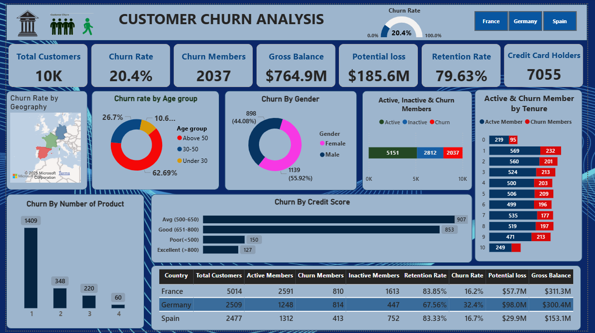

# Bank-Churn-Analysis-using-SQL-Power-BI
Customer churn is a major challenge for banks and financial institutions.  
This project analyzes 10K+ customers to understand who is churning, why they churn, and how to reduce churn.

# 📊 Customer Churn Analysis

This repository contains a **Customer Churn Analysis dashboard** built in **Power BI** and a **PowerPoint presentation** summarizing key business insights and recommendations.  
The project focuses on identifying drivers of churn and suggesting actionable solutions for retention.

---

## 🚀 Project Overview
Customer churn is a major challenge for banks and financial institutions.  
This project analyzes **10K+ customers** to understand **who is churning, why they churn, and how to reduce churn**.

---

## 📸 Dashboard Preview

---

## 📌 Key Insights
1. **Overall Churn**
   - Churn Rate = **20.4%** → 2,037 customers lost.
   - Potential loss = **$185.6M**.

2. **Geography**
   - **Germany has the highest churn (32.4%)** compared to France (16.2%) & Spain (16.7%).

3. **Demographics**
   - **Age 30–50 = 62.7% of churners** (highest risk group).
   - Male churn (55.9%) is slightly higher than Female (44.1%).

4. **Credit Score**
   - **Avg (500–650): 907 churners**.
   - **Good (651–800): 853 churners** (unexpected → not only risk-driven).
   - Even **Excellent (>800)** customers leave → points to **service/experience issues**.

5. **Tenure**
   - **Highest churn in early years (1–3 years)** → onboarding is weak.
   - Longer tenure = higher loyalty.

6. **Product Holding**
   - **1-product customers = 69% of churn (1,409 out of 2,037)**.
   - Multi-product customers are significantly more loyal.

---

## 💡 Recommendations
1. **Geography Focus**
   - Target **Germany** with localized retention programs.

2. **Early-Customer Experience**
   - Improve **onboarding in the first 1–2 years**.
   - Provide loyalty bonuses, welcome packs, personalized guidance.

3. **Segmentation by Age & Credit Score**
   - Age 30–50: Offer tailored products (loans, investments).
   - 500–650: Provide credit-building products.
   - 651–800 & >800: Premium/VIP benefits to prevent attrition.

4. **Cross-Selling**
   - Incentivize single-product holders to adopt **2+ products**.
   - Example: bundle credit cards with savings/investments.

5. **Service Quality**
   - Run **NPS surveys & exit interviews**.
   - Enhance **digital banking & customer support**.

---

## 📂 Repository Contents
- `Customer_Churn_Insights.docx` → Document with insights & solutions.
- `dashboard.png` → Power BI dashboard screenshot.
- README.md → Project summary (this file).

---

## 📌 Strategic Takeaway
Churn is concentrated among **German customers, mid-age professionals, and 1-product holders**.  
By focusing on **early engagement, product bundling, and premium experiences**, churn could be reduced by **5–8%**, protecting **$40M–$60M annually**.

---

## 🛠️ Tools Used
- **Power BI** → Dashboard & data visualization
- **DAX** → Credit score categorization & calculations
- **GitHub** → Project documentation & sharing

---

👤 **Author**: *SAJJAD ALI*  
📧 Contact: *sajjadali.ra3g3@gmaiol.com*
